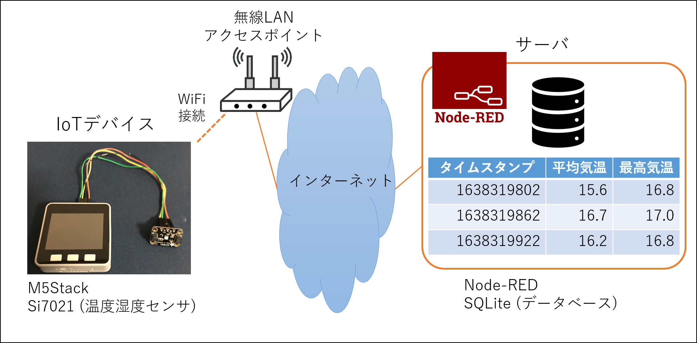

# エッジコンピューティング開発実習 1

## IoT 歩数計システムの開発

この実習では歩数計を IoT 化したシステムを構築します。

M5Stack (Gray) をウェアラブルな歩数計とみなし、利用者はこの歩数計を身に着けて利用します。
歩数計は M5Stack (Gray) に内蔵された加速度センサーにより利用者の歩行を検出し、歩数をカウントします。
さらに、歩数計は直近 1 分間での利用者の歩数と現在時刻を利用者の活動情報として、 1 分ごとにクラウドサーバ上に構築されたデータベースへと送信し記録していきます。

---

## システムの全体構成

---

## IoTデバイス側の要件

### 使用器材

- M5Stack Gray

### IoTデバイスに求められる機能

1. ネットワークへの接続 : インターネットに接続された Wi-Fi アクセスポイントへ無線接続し、実習用の Node-RED サーバへデータを送信できるようにします。

2. 時刻の取得 : NTPプロトコルによりデバイス内部の時計を現在時刻に同期させ、正確な現在時刻を取得できるようにします。

3. 歩数のカウント : 加速度センサから得られるデータを分析して、利用者の歩行を検出し、歩数をカウントします。

4. 活動情報の送信 : 1 分間隔で利用者の「活動情報」を実習用 Node-RED サーバに構築したデータベースへ送信します。
ここで「活動情報」は以下の表により定義します。

[表1.「活動情報」の定義]
| 項目 | 内容 |
|---|---|
| timestamp | データ送信時点の UNIX time (整数値) |
| step | 直近 1 分間の歩数 (整数値) |

---

## クラウドサーバ側の要件

実習用に準備された Node-RED サーバを用いてシステムを構築します。
データベースマネージメントシステムとして Node-RED へ SQLite を事前にインストールしてください。

---

## 参考

- [M5Stack で現在時刻を取得する](./ntp_unixtime)
- [M5Stack Gray で加速度センサを使用する](./imu_accel)
- [Node-RED にSQlite データベースを構築する](./sqlite_on_nodered)

