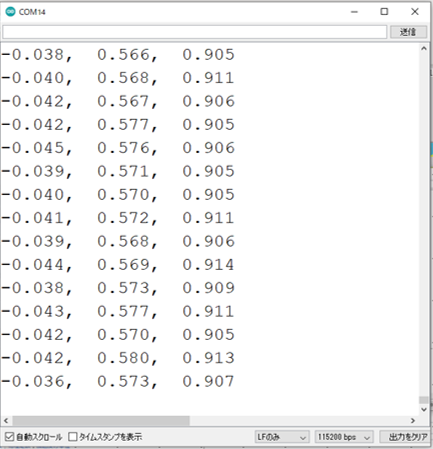

# MStack5 Gray で加速度センサーを使用する

M5Stack5 Gray には 3 軸加速度センサー、3 軸ジャイロセンサー、3 軸磁気センサーを備えた 9軸 IMU (慣性計測装置) として MPU6886 が搭載されています。

ここでは、この IMU を使って x, y, z 軸方向の加速度を計測する方法を説明します。
各 x, y, z 軸方向は以下の図のように定められます。


---

## 加速度計測のためのライブラリ関数

M5Stack のライブラリ M5Stack.h には IMU を有効にするための関数 `M5.IMU.init` と、IMU で計測した各軸の加速度を取得する関数 `M5.IMU.getAccelData` が宣言されています。

なお、これらの関数を使用する場合、以下のように `M5STACK_MPU6886` を M5Stack.h をインクルードする前に定義する必要があります。

````C
#define M5STACK_MPU6886
#include <M5Stack.h>
````

---

### IMU の有効化 : M5.IMU.init

書式 :

  `void M5.IMU.init();`

IMU を有効化し初期化します。

---

### 各軸方向の加速度を取得する : M5.IMU.getAccelData

書式 :

  `void M5.IMU.getAccelData(float* ax, float* ay, float* az);`

|引数|説明|
|----|----|
| ax | x 軸方向の加速度が格納される(単位:重力加速度 g) |
| ay | y 軸方向の加速度が格納される(単位:重力加速度 g) |
| az | z 軸方向の加速度が格納される(単位:重力加速度 g) |


---

## スケッチ例 1. 

x, y, z軸方法の加速度を 100 ms 毎に取得し、シリアルモニターに出力するプログラムを示します。

````C
// (1) M5STACK_MPU6886 の定義
#define M5STACK_MPU6886
#include <M5Stack.h>

void setup() {
  M5.begin();
  M5.Power.begin();
  // (2) IMUの初期化
  M5.IMU.Init();

  M5.Lcd.fillScreen(BLACK);
  M5.Lcd.setTextSize(3);
}

void loop() {
  // (3) x, y, z軸方向の加速度の取得
  float accX, accY, accZ;
  M5.IMU.getAccelData(&accX,&accY,&accZ);

  Serial.printf("%6.3f, %6.3f, %6.3f\n",accX, accY, accZ);
  delay(100);
}

````

M5Stack をPCにUSBでシリアル接続した状態でこのプログラムを実行すると、以下の図のようにシリアルモニターへ x, y, z軸方向の加速度が表示されます。



Arduino IDE に搭載されているシリアルプロッター (ツール > シリアルプロッタ から起動) を使うと以下の図のように加速度の変化がグラフとして表示されます。

