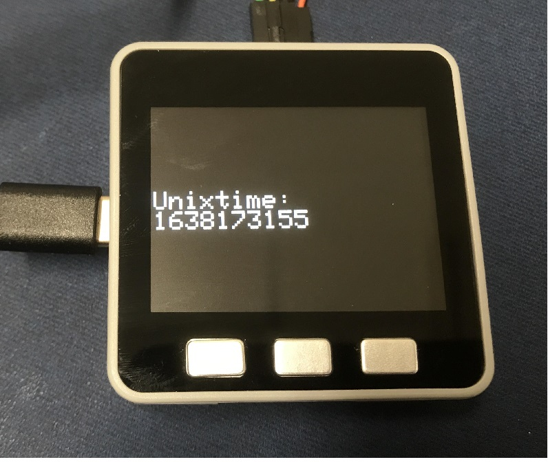

# M5Stack で現在時刻を取得する

IoTデバイスで得られる各種のセンサー情報を有効に活用するためには、
センサーで取得したデータに加え、そのデータを取得した時刻の情報を付与することが求められます。

ここでは、インターネットからNTP(Network Time Protcol)というプロトコルによって現在時刻を取得する方法を説明します。

---

## 時刻取得のためのライブラリ関数

M5Stack には NTP プロトコルによって現在時刻を取得するライブラリが用意されています。

`configTime` 関数で接続するNTPサーバなどの設定を行った後、`getLocalTime` 関数によって現在時刻を取得できます。

---

###  NTPサーバとローカルタイムゾーンの設定 : `configTime`

[書式]

  `void configTime(long gmtOffset_sec, int daylightOffset_sec, const char* server);`

|引数|説明|
|----|----|
|gmtOffset_sec| 協定世界時(UTC)との時差(秒)|
|daylightOffset_sec| 夏時間で進める時間(秒)|
|server| NTPサーバのURL |

NTPサーバのURLには、"ntp.nict.jp", "time.google.com" などを設定するとよいでしょう。

[使用例]

  `configTime(0, 0, "ntp.nict.jp");`

---

### 現在時刻を取得 : `getLocalTime`

書式 :

  `bool getLocalTime(struct tm * info, unit32_t ms);`

|引数|説明|
|----|----|
|info| 時刻情報を格納する領域|
|ms  | タイムアウト時間 |

戻り値 :
時刻の取得に成功するとtrue, 失敗すると false が返る。

使用例: 

構造体型 `struct tm` の変数 `timeinfo`
に時刻情報が格納されます。

````C
struct tm timeinfo;
getLocalTime(&timeinfo); 
````

---

### 時刻情報を保持する構造体型 struct tm について

`getLocalTime` へ渡す構造体 `struct tm` には以下のメンバー変数が定義されています。

````C
int tm_year; // 1900 年を 0 とした年数
int tm_mon;  // 1 月を 0 とした月数　[0-11]
int tm_mday; // 日 [1-31]
int tm_hour; // 時 [0-23]
int tm_min;  // 分 [0-59]
int tm_sec;  // 秒 [0-59]

````

---

## スケッチ例 1 : 現在時刻の UNIX time をLCDに表示する

`configTime` と `getLocalTime` を使って、現時刻を取得し、UNIX time (協定世界時 (UTC) での1970年1月1日午前0時0分0秒から経過秒数) としてLCDに表示するプログラムを示します。

インターネットに接続するため Wi-Fi アクセスポイントが必要となります。

プログラム中の `<your WiFi SSID>` と `<your WiFi password>` はそれぞれ実習で用いる Wi-Fi アクセスポイントの SSDI とパスワードに置き換えてください。



---

### プログラム

````C
#include <M5Stack.h>
#include <WiFi.h>

void connectWiFi();
unsigned long getUnixtime();

// WiFi SSID, password
const char *ssid = "<your WiFi SSID>";
const char *password = "<your WiFi password>";

// NTP Server
const char *ntpServer = "ntp.nict.jp";

void setup() {
  M5.begin(true, false, true, false);
  M5.Speaker.mute();
  M5.Lcd.fillScreen(TFT_BLACK);
  M5.Lcd.setTextSize(3);
  // Wifi connection
  connectWiFi();

  // 接続するNTPサーバ等の設定
  configTime(0, 0, ntpServer); // (1) configTimeの呼び出し
}

void loop() {

  M5.Lcd.setCursor(0, 100);
  M5.Lcd.println("Unixtime:");

  M5.Lcd.println(getUnixtime()); // UNIX time の取得と表示

  delay(5 * 1000);
}

/////

// 現在時刻を取得して unixtime を返す 
unsigned long getUnixtime() {
  struct tm timeinfo;
  if (!getLocalTime(&timeinfo)) { // (2) getLocalTimeの呼び出し
    Serial.println("Failed to obtain time");
    return 0;
  }

  time_t now;
  time(&now); // (3) UNIX time を取得
  return (unsigned long) now;
}

//////

void connectWiFi() {
  Serial.println("connecting WiFi");
  WiFi.mode(WIFI_STA);
  WiFi.begin(ssid, password);
  while (WiFi.status() != WL_CONNECTED) {
    Serial.print(".");
    delay(500);
  }  
  Serial.println("connected!");
}

````

---

### 説明

(1) `configTime` の呼び出し

`setup` 関数内で、`configTime` 関数を呼び出しています。
````C
// setup() 内 //
configTime(0, 0, ntpServer); // (1) configTimeの呼び出し
````
ここでは Unix Time を取得するため、タイムゾーンとしてグリニッジ標準時を想定し、サマータイムもなしとして第 1、第 2 引数にそれぞれ 0 を設定しました。第3引数には接続するNTPサーバのURL "ntp.nict.jp" を渡しています。

UNIX time を取得し返す関数として
`unsigned long getUnixtime()` を定義してプログラム中(`loop`関数内)で利用しています。

`getUnixtime`関数において、
`struct tm` 型の変数 `timeinfo` を宣言し、`getLocalTime`関数の呼び出し時に渡しています。

(2) getLocalTimeの呼び出し

````C
struct tm timeinfo;
  if (!getLocalTime(&timeinfo)) { // (2) getLocalTimeの呼び出し
````
`getLocalTime` 関数を呼び出すと `timeinfo` には時刻情報が格納されます。(ただし、今回はこの時刻情報は利用していません)

(3) UNIX timeの取得

`getLocalTime` を呼び出して時刻情報の取得に成功した後、
`time`関数へ `time_t` 型の変数を渡して呼び出すと変数へ現在時刻のUNIX time が格納されます。

````C
time_t now;
time(&now); // (3) UNIX timeの取得
````

なお`time`関数は、`getLocalTime` で現在時刻を取得していない状態で呼び出した場合は、プログラムが起動してからの経過時間(秒)が得られます。

---

## スケッチ例 2. 現在の日時をLCDに表示する


````C
#include <M5Stack.h>
#include <WiFi.h>

void connectWiFi();
unsigned long getUnixtime();

// WiFi SSID, password
const char *ssid = "<your wifi ssid>";
const char *password = "<your wifi password>";

// NTP Server
const char *ntpServer = "ntp.nict.jp";

void setup() {
  M5.begin(true, false, true, false);
  M5.Speaker.mute();
  M5.Lcd.fillScreen(TFT_BLACK);
  M5.Lcd.setTextSize(3);
  // Wifi connection
  connectWiFi();

  // 接続するNTPサーバ等の設定
  configTime( 9 * 60 * 60 /* JST */, 0, ntpServer); // (1) configTimeの呼び出し
}

void loop() {

  M5.Lcd.setCursor(0, 100);
  M5.Lcd.println("Unixtime:");

  M5.Lcd.println(getDateTime());

  delay(1000);
}

/////

// 現在時刻を取得し YYYY-MM-DD hh:mm:ss の形式の文字列として返す 
String getDateTime() {
  struct tm timeinfo;
  if (!getLocalTime(&timeinfo)) { // (2) getLocalTimeの呼び出し
    Serial.println("Failed to obtain time");
    return String("Failed to obtain time");
  }

  int year    = timeinfo.tm_year + 1900;
  int month   = timeinfo.tm_mon + 1;
  int day     = timeinfo.tm_mday;
  int hour    = timeinfo.tm_hour;
  int minute  = timeinfo.tm_min;
  int second  = timeinfo.tm_second;
  char buf[60];
  sprintf(buf, "%4d-%02d-%02d %02d:%02d:%02d", 
                year, month, day, hour, minute, second);
  return String(buf);
  
}

//////

void connectWiFi() {
  Serial.println("connecting WiFi");
  WiFi.mode(WIFI_STA);
  WiFi.begin(ssid, password);
  while (WiFi.status() != WL_CONNECTED) {
    Serial.print(".");
    delay(500);
  }  
  Serial.println("connected!");
}
````