# Node-RED に SQLite データベースを構築する

IoTデバイスから送られる各種のセンサー情報を有効に活用するためには、そのデータを蓄積するためのデータベースが必要となります。

ここでは Node-RED 上に SQLite インストールして、リレーショナルデータベースを構築し、SQLクエリによりデータを追加したり、データの一覧を表示したりする方法を説明します。

---

## SQLite について

SQLiteは軽量なリレーショナルデータベース管理システム(RDBMS)です。

- SQLite 公式ページ　https://sqlite.org/index.html

SQL クエリによって、テーブルを作成したり、データを追加したり、条件に合うデータを検索したりすることができます。

SQLite は、Node-RED へもインストールして使用することが可能です。 

---

## SQLite を Node-RED へインストールする

1. Node-RED のメニューボタン(画面右上の三本線のボタン)を押し、「パレットの管理」を選択します。

2. ユーザー設定のペインが表示されます。ペインの左部のメニューから「パレット」を選択し、さらに
上部のタブから「ノードを追加」タブを選択します。

3. 検索欄に node-red-node-sqlite と入力すると、一覧に「node-red-node-sqlite」が表示されますので、これを選択してインストールします。
 
 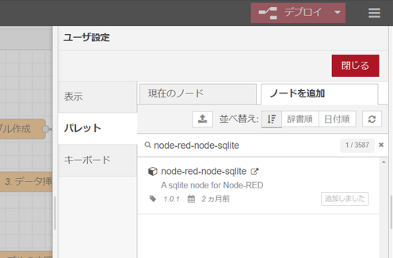

4. インストールに成功するとパレットに sqlite ノードが追加されます。 
  
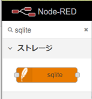

---

## データベースの作成と HTTP GET メソッドによるデータの挿入

Node-RED にデータベースを作成し、HTTP GETメソッドによってデータベースへデータを追加できるようなシステムを構築します。

sqlite, template, http in, http response, inject, debug ノードを使って図のようにノードを配置して組み合わせてください。

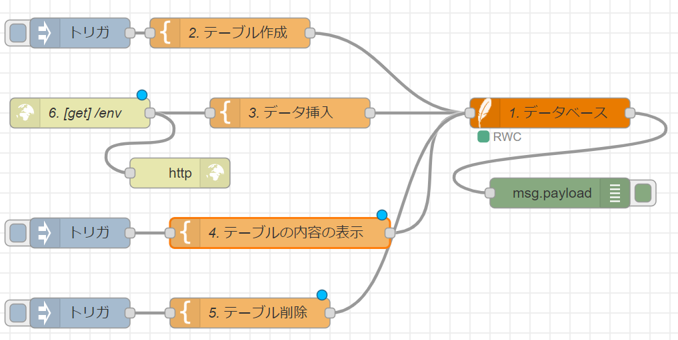

以下、sqlite, template, http in ノードの設定を行っていきます。
inject, debug, http response ノードについてはデフォルトの設定のままで大丈夫です。

---

### sqlite ノード の設定

sqlite ノード「1. データベース」を設定します。
 
 1. ノードをダブルクリックして「sqliteノードを編集」ペインを開きます。データベースの欄で「新期にsqlitedbを追加」を選び、編集ボタン(右隣の鉛筆ボタン)を押します。

2. 「sqliteノードを編集 > 新規に sqlitedb 設定ノード追加」のペインが開きます。
データベース欄にデータベースを格納するファイルの場所とファイル名を入力します(例 testdb)。
モードは「読み取り-書き込み-作成」を選択します。追加ボタンをクリックします。

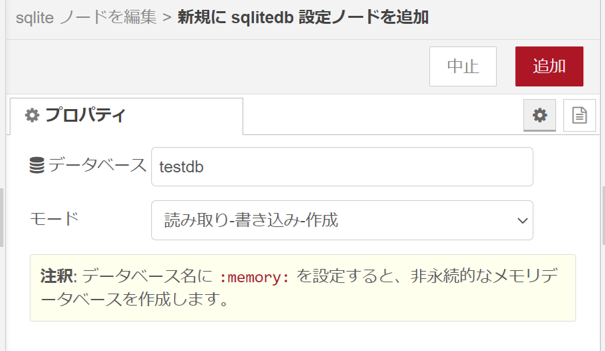

3. 「sqliteノードを編集」ペインに戻ります。データベース欄に先ほど追加したデータベースを選択します。
SQLクエリ欄は「msg.topic経由」を選択します。
完了をクリックして設定を終了します。

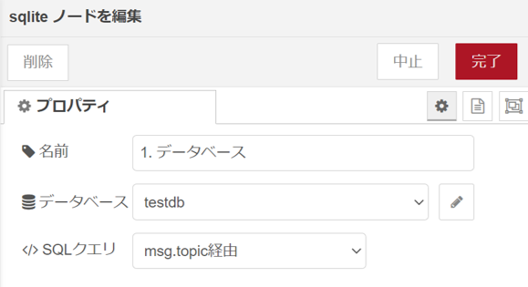

---

### template ノードの設定

#### template ノード「2. テーブル作成」の設定

「2. テーブル作成」は以下のように設定してください。

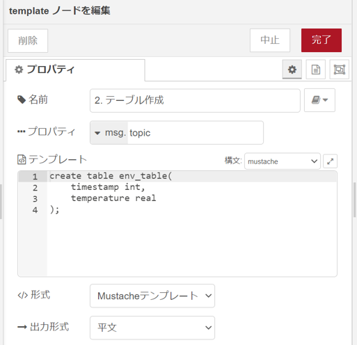

プロパティ、形式、構文、出力形式は以下のように設定します。これらは他の template ノードでも同じにように設定します。

| 欄 | 設定値 |
|---|---|
|プロパティ| msg.topic |
|構文| Mustache |
|形式| Mustacheテンプレート |
|出力形式| 平文 |
 
テンプレート欄には SQL クエリを記述します。

ここでは create 文で新たなテーブル env_table を作成しています。IoTデバイスから送られる気温と測定時刻のUNIX timeを受信してそのデータを記録することを想定し、env_table の各カラムの定義は以下の通りとしました。

|カラム名|データ型| 備考 |
|---|---|---|
| timestamp | int | UNIX time |
| temperature | real | 気温 |

[テンプレート]

````SQL
create table env_table(
  timestamp int,
  temperature real
);
````

---

#### template ノード「3. データ挿入」の設定

「3. データ挿入」は以下のように設定してください。

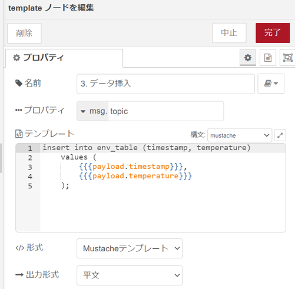

テンプレート欄には insert 文により、env_table へデータを挿入するSQLクエリを記述しています。
このノードに接続されている http in ノード「6.[get]/env」より渡される payload から timestamp フィールドとtemperature フィールドのデータを取り出してクエリへ挿入しています。のとき、Mustache 構文 ``{{{payload.timestamp}}}``、``{{{payload.temperature}}}`` を使っています。

[テンプレート]

````
insert into env_table (timestamp, temperature)
  values (
    {{{payload.timestamp}}},
    {{{payload.temperature}}}
  );
````

---

#### template ノード「4. テーブルの内容の表示」の設定

「4. テーブルの内容の表示」は以下のように設定してください。

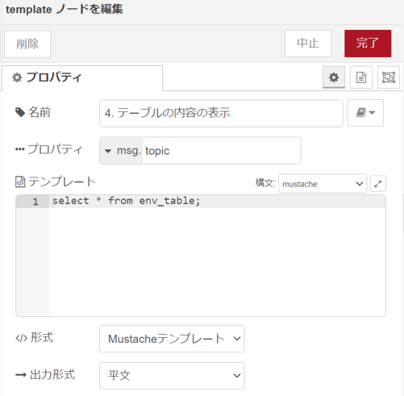

テンプレート欄には、
select 文により env_table に保持されているすべてのデータを取得する SQL クエリを記述しています。

[テンプレート]

````SQL
select * from env_table;
````

---

#### template ノード「5. テーブルの削除」の設定

「5. テーブル削除」は以下のように設定してください。

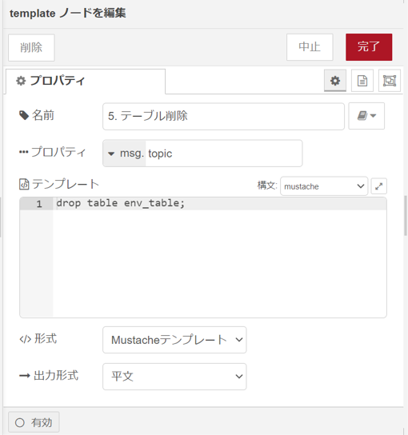

テンプレート欄には、
drop 文により env_table を削除する SQLクエリを記述しています。

[テンプレート]

````SQL
drop table env_table;
````

---

### http in ノードの設定

http in ノード「6. [get]/env」は次のように設定します。

| 項目 | 設定値 |
|---|---|
| メソッド | GET |
| URL | /env |

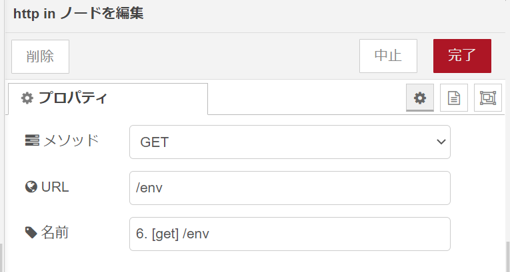

これにより、 GET リクエストを受け付けるエンドポイントとして
`<Node-RED サーバのURL>/env` が設定されます。
例えば、Node-RED サーバの URL が `http://your_node_red_server:1880/` の場合、
`http://http://your_node_red_server:1880/env` がエンドポイントとなります。

また、http inノードは GET リクエストで受け取った URL パラメータを Json 形式に変換し payload として、次段に接続されているtemplate ノード「3. データ挿入」へ渡します。


---

### 動作確認

各ノードの設定が終わったら、デプロイを行ってください。

--

1. テーブルの作成 : template ノード 「2. テーブルの作成」に接続している inject ノードのボタンをクリックします。新たなテーブル env_table が作成されます。テーブルの作成は一度だけ行います。

2. HTTP GET リクエストの送信 : WebブラウザやIoTデバイスから、http in ノード「4. [get]/env」で設定したエンドポイントへ送信データに応じたURLパラメータを付与してGETリクエストを送信します。

  例 :

  あなたが使用しているNode-RED サーバの URL が `http://your_nodered_server.kosen-ac.jp:1880` の場合、Webブラウザなどで以下のURLにアクセスします。

  `http://your_nodered_server.kosen-ac.jp:1880/env?timestamp=1638319902&temperature=15.3`

  timestamp や temperature の設定値を変えて何度かアクセスしてみましょう。

3. テーブルの内容の確認 : template ノード「5. テーブルの内容の表示」に接続している inject ノードのボタンをクリックします。sqlite ノード「1. データベース」に接続されている debug ノードのデバッグメッセージを確認します。HTTP GET リクエストによって送ったデータ(timestamp, temperature) が確かにデータベースに登録されていることが確認できます。

  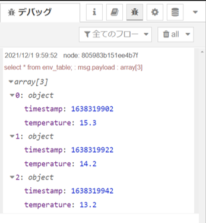

4. テーブルの削除 : template ノード「5. テーブルの内容の表示」に接続している injectノードのボタンをクリックします。env_table が削除されます。
